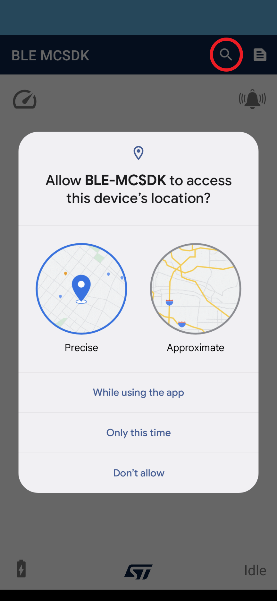
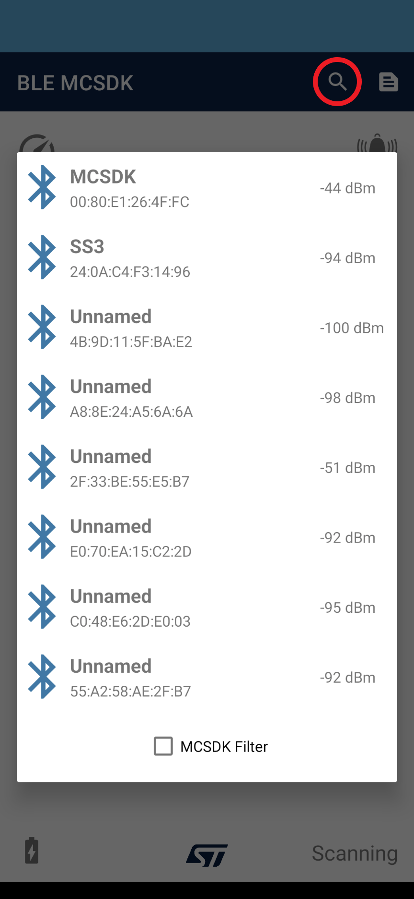
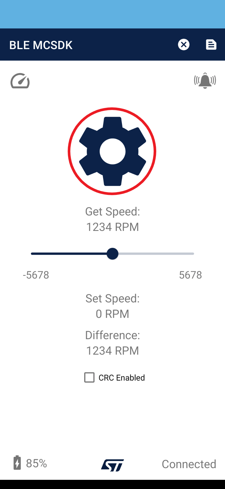
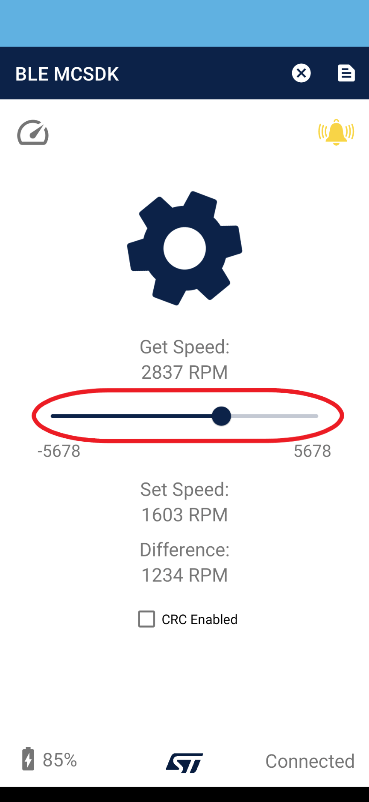
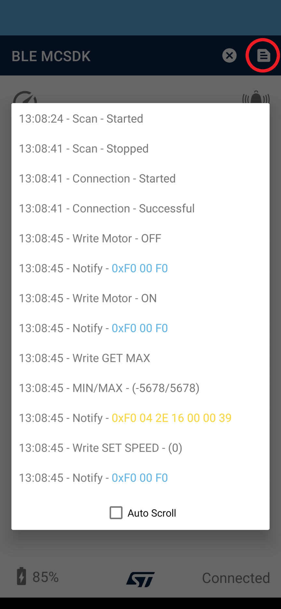
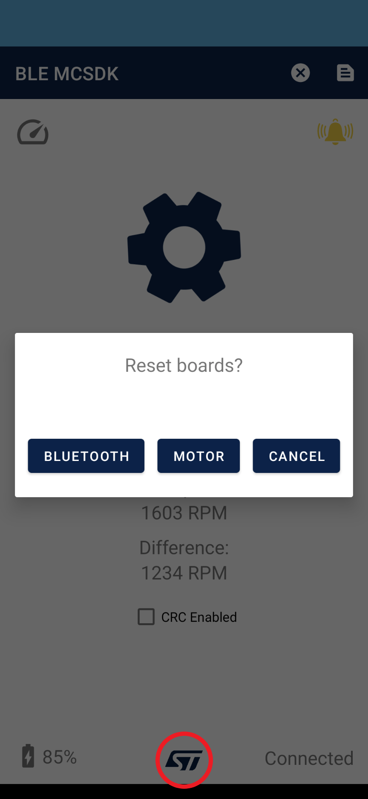

# STM32WB-BLE-Motor-Control-SDK-Android App for STM32WB Motor Control

   

The STM32WB-BLE-Motor-Control-SDK-Android is an application created by ST Microelectronics for mobile devices running Android. The app allows a user to connect to a ST Nucleo-WB55 board with a motor attached to it and control the motor’s speed (RPM) and direction through Bluetooth. On connection, the app will request the min & max motor speeds to use as limits and through out the connection it will periodically request the current motor speed every 100ms to display to the user. A live time-log is also available to view the application & Bluetooth activities.

## Application Details

* App Name: BLE-MCSDK
* App Version: 1.0.4
* Package: com.stm.ble_mcsdk

- Minimum Android SDK: 21 (Android 5)
- Target Android SDK: 31 (Android 12)

* 100% Kotlin
* MVVM Architecture

- Tested on the Following Devices:
    * Samsung Galaxy Tab A7 Lite
    * Google Pixel 5

## Permissions

* BLUETOOTH
* BLUETOOTH_ADMIN
* ACCESS_FINE_LOCATION
* ACCESS_COARSE_LOCATION
* BLUETOOTH_CONNECT
* BLUETOOTH_SCAN

## Dependencies

* Core-KTX
* AppCompat
* Material
* ConstraintLayout
* [AppIntro](https://github.com/AppIntro/AppIntro)
* Junit
* Espresso
* [Timber](https://github.com/JakeWharton/timber)
* Fragment
* Lifecycle-Runtime
* Lifecycle-ViewModel
* Lifecycle-LiveData

## Software
Go to [Utilities/Documentation](Utilities/APK) to download the Android APK.

## Hardware
Go to [MCSDK Github Repo](https://github.com/stm32-hotspot/STM32WB-BLE-Motor-Control-SDK) to view the necessary hardware.

## Documentation
Go to [Utilities/Documentation](Utilities/Documentation) to view the code documentation.

## App User Guide
1. Download the APK and install it on a mobile device running the minimum supported Android version.
    * You may need to change a setting that allows the installation of "unknown apps" to install the APK.
2. On first open, the application will show you an explanation on how to use the app. Tap on skip to skip this if you already know how to use the app.

   

3. Tap on the search icon in the toolbar to start a Bluetooth scan.
    * You may be prompted with permission requests. These are necessary for Bluetooth functionality, tap approve on each request.

   

4. Once scanning has started you will see a list of nearby Bluetooth devices. Tap on a device to attempt a Bluetooth connection.
    * By default, the list is filtered to devices named "MCSDK". Uncheck the checkbox filter at the bottom to see all nearby devices.
5. On successful connection, the motor control becomes accessible and the app will attempt to request the motor speed limits from the connected device.
    * You may also manually set the min/max speed limits by tapping the speed icon on the top left corner.

   

6. Tap on the large motor (cogwheel) icon to turn off & on the motor.

   

7. Use the speed slider to set the speed of the motor in a clockwise or counter-clockwise direction.
    * Get Speed shows you the actual motor speed.
    * Set Speed shows you the speed you set from the slider.
        * Tap the set speed value to manually type in a speed value.
    * Difference will show you the difference between the set speed and actual motor (get) speed.

   

8. Tap the log icon on the toolbar to see a time log of the app and Bluetooth operations.
9. The bell icon on the top right will light up indicating a response from the connected device.
    * Blue = Normal Response
    * Yellow = Speed Response
    * Pink = Error Response

   

10. Tap on the ST icon at the bottom while connected to send a Bluetooth or motor reset command to the connected device.

## Troubleshooting

**Caution** : Issues and pull-requests are **not supported** to submit problems or suggestions related to the software delivered in this repository. The BLE MCSDK is being delivered as-is, and not necessarily supported by ST.

**For any other question** related to the product, the hardware performance or characteristics, the tools, the environment, you can submit it to the [ST Community](https://community.st.com).
